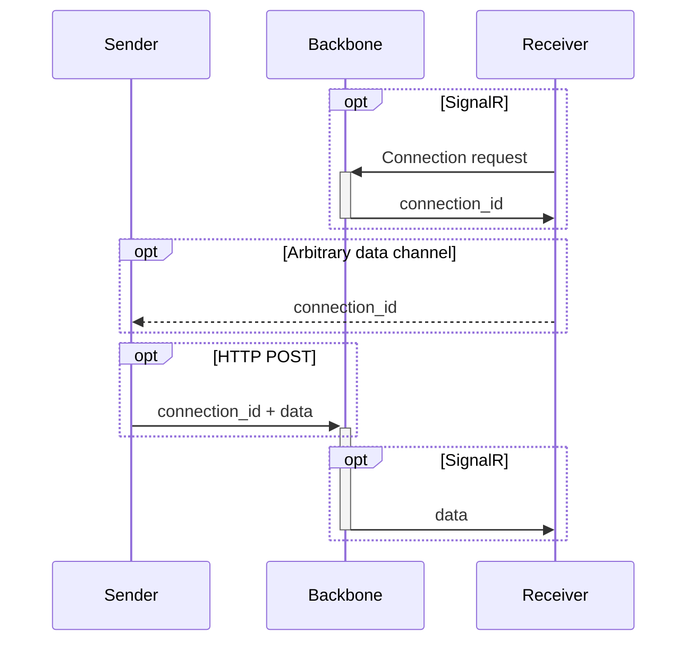

# Backbone

[](https://github.com/XFox111/backbone/commits/main)
[](https://hub.docker.com/r/xfox111/backbone/)

Small ASP.NET web server for one way communication between two clients.

This server is one of the key components of [EasyLogon project](https://github.com/xfox111/easylogon-web).

## Overview



### Endpoints
- **SignalR**: `/ws` - WebSocket endpoint for real-time communication.
- **POST**: `/send?id={connectionId}` - HTTP POST endpoint for sending data to the receiver.

Body of the `/send` endpoint must be of type `Content-Type: application/json`.

### Key points

- The arbitrary channel for `connectionId` tranmission should be as secure as possibe (preferably an offline channel), since posession of `connectionId` can pose a security threat.
- Connection between Backbone and receiver preferably should be re-established after every transmission to avoid replay attacks.

## Related papers

- [QR Code Authentication System as an Ultimate Tool for Personal Cybersecurity (2023, IEEE)](https://ieeexplore.ieee.org/abstract/document/10397212)

## Development

### Prerequisites

For development you can use [Dev Containers](https://devcontainers.io/) or [GitHub Codespaces](https://github.com/features/codespaces). Otherwise you will need to install following tools:
- [.NET SDK 9](https://dotnet.microsoft.com/download/dotnet/9.0)
- [Docker](https://www.docker.com/)


### Building and debugging

Here're some commonly used commands:
```bash
dotnet restore			# Install dependencies
dotnet run				# Start the development server
dotnet build			# Build the project for production
```

To build a Docker image, run:

```bash
docker build -t backbone:latest .

# To run the Docker container:
docker run -d -p 8080:8080 --name backbone_server backbone:latest
```

> [!TIP]
> If you use VS Code, you can also use pre-defined tasks for building and debugging.

## Contributing
[](https://github.com/xfox111/backbone/issues)
[](https://github.com/XFox111/backbone/actions/workflows/ci.yaml)
[](https://github.com/xfox111/backbone)

There are many ways in which you can participate in the project, for example:
- [Submit bugs and feature requests](https://github.com/xfox111/backbone/issues), and help us verify as they are checked in
- Review [source code changes](https://github.com/xfox111/backbone/pulls)
- Review documentation and make pull requests for anything from typos to new content

If you are interested in fixing issues and contributing directly to the code base, please refer to the [Contribution Guidelines](/CONTRIBUTING.md)

---

[](https://bsky.app/profile/xfox111.net)
[](https://github.com/xfox111)
[](https://buymeacoffee.com/xfox111)

> ©2025 Eugene Fox. Licensed under [MIT license](/LICENSE)
